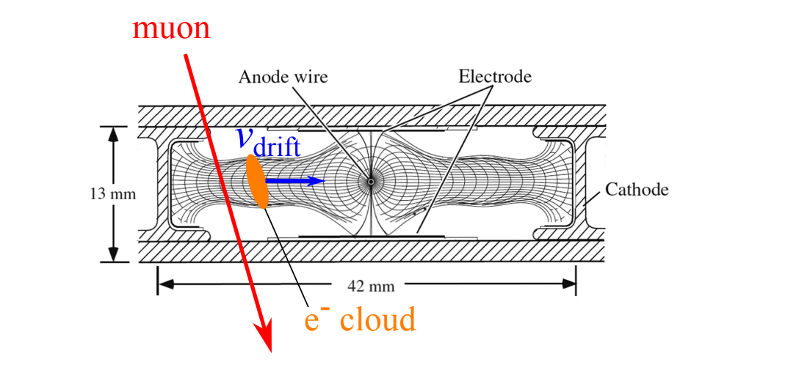
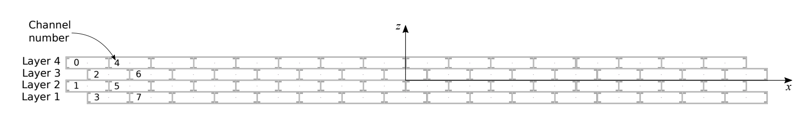
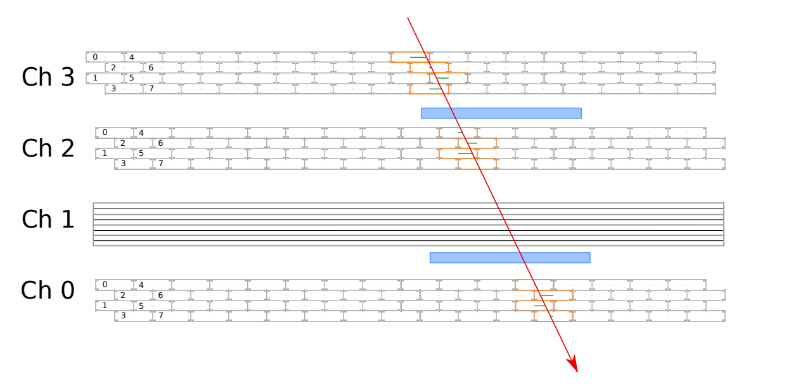

# Streaming Processing of Cosmic Rays using Drift Tubes Detectors
## Introduction
This project focuses on real-time processing of data collected from a particle physics detector, specifically using Drift Tubes (DT) detectors. The goal is to develop a streaming application that monitors the quality of the detector in real-time and presents the results in a live monitoring dashboard.

## Theoretical description
A set of muon detectors, known as mini Drift Tubes (miniDTs), has been constructed and installed in Legnaro INFN Laboratories, located approximately 10 km from Padova. These detectors are designed to capture signals emitted by cosmic rays. The miniDTs operate based on the principle of ionization: when charged particles pass through the detector's volume, they ionize the gas mixture inside, creating electron-ion pairs. Electric fields shaped in a specific manner enable the electron cloud to drift at a nearly constant velocity ($v_{drift} = 53.8$ µm/ns). Near the sensing anode wire, the intense electric field triggers further ionization and avalanche, amplifying the signal.

The signals are collected on the anodic wire, amplified, digitized, discriminated, and processed through a Data Acquisition (DAQ) system. Within the DAQ system, a set of Field-Programmable Gate Arrays (FPGAs) perform Time-to-Digital Conversion (TDC), associating a digital signal with the time of collection for each electron cloud reaching the wire. These digitized signals are commonly referred to as "hits."

By knowing the passage time of the muon (referred to as t0), the TDC of a hit can be translated into a position within the cell using the constant drift velocity (vdrift). The position ($x_{hit}$) is calculated as follows:
$$x_{hit} = (t_{hit} − t_0) \times v_{drift}.$$

However, the time of passage for the muon is not generally known in advance and must be extracted from external information or geometric considerations.

Additionally, there is an inherent left-right ambiguity associated with the time-to-space conversion. The time information from a single hit is insufficient to determine whether the muon passed through the right or left half of the cell. To resolve this ambiguity and identify the track trajectory across one or more DT chambers, a complete reconstruction of a track spanning multiple cells is required.

The geometry of a single miniDT chamber consists of 64 cells organized into four layers, with 16 cells in each layer. Adjacent layers are staggered by half of a cell width. Each cell has a transversal dimension of 42 × 13 mm² (width × height). The following figure illustrates the schema for a single DT chamber:

Four DT chambers are stacked in a "muon-telescope" configuration, where chambers 0, 2, and 3 have the same orientation, while chamber 1 is rotated 90 degrees to measure in the orthogonal view. Two external detectors, represented by plastic scintillator palettes (shown in blue in the figure), provide external timing information for the particle passage, including the t0 information.

## Task
The main tasks of this project include:

Collecting data from the detector's Data Acquisition System (DAQ) and streaming it to a Kafka topic using a stream-emulator script.

Processing the collected hits using a distributed framework such as Dask or PySpark.

Re-injecting the processed results into a new Kafka topic hosted on the same brokers.

Developing a consumer script (preferably in Python) that retrieves the processed data from the Kafka topic and generates live updates and visualizations of the evaluated quantities. Bokeh or Matplotlib's pyplot can be used to create simple "dashboards" for this purpose.

The overall architecture of the project can be summarized as follows:

Data Structure
The dataset is provided in multiple text files stored as comma-separated values (CSV) in a cloud storage S3 bucket hosted on Cloud Veneto. The dataset can be accessed using the following link: [mapd-minidt-stream](https://cloud-areapd.pd.infn.it:5210/swift/v1/AUTH_d2e941ce4b324467b6b3d467a923a9bc/mapd-minidt-stream/). Detailed instructions on managing the storage and accessing the dataset can be found [here](https://userguide.cloudveneto.it/en/latest/ManagingStorage.html#object-storage-experimental).

An example of the data format is as follows:

| HEAD | FPGA | TDC_CHANNEL |  ORBIT_CNT | BX_COUNTER | TDC_MEAS |
|:----:|:----:|:-----------:|:----------:|:----------:|:--------:|
|   1  |   1  |      0      | 3387315431 |      0     |    130   |
|   0  |   1  |      2      | 3387315431 |    1119    |    24    |
|   4  |   1  |      0      | 3387315431 |      0     | -0.57373 |
|   5  |   1  |      0      | 3387315431 |      0     |   45.5   |
|   2  |   0  |      75     | 3387200947 |    2922    |     2    |
|   2  |   0  |     105     | 3387200955 |    2227    |    29    |
|  ... |  ... |     ...     |     ...    |     ...    |    ...   |

## Dataset Processing
The dataset processing can be performed using either Spark or Dask. It is recommended to work with data batches of a few seconds in duration (1 to 5 seconds).

The processing workflow involves the following steps:

  - Perform data cleansing by removing entries with HEAD != 2, as they contain ancillary information not relevant to the project.
  - Map the data-format to the corresponding detectors based on the FPGA and TDC_CHANNEL values.
  - Compute the following information for each data batch:
  - Total number of processed hits after data cleansing (1 value per batch).
  - Total number of processed hits after data cleansing, per chamber (4 values per batch).
  - Histogram of the counts of active TDC_CHANNEL values per chamber (4 arrays per batch).
  - Histogram of the total number of active TDC_CHANNEL values in each ORBIT_CNT per chamber (4 arrays per batch).
  - Wrap the processed information into one message per batch and inject it into a new Kafka topic.

## Live Plotting
The results of the processing should be presented in the form of a continuously updating dashboard. A Python script (or another language) should consume data from the Kafka topic and generate plots and histograms of the quantities mentioned above.

You can use Python modules such as Bokeh or Matplotlib's pyplot (free version) to create a continuously updating webpage for visualizing the plots. However, feel free to explore and utilize any other suitable solutions for this task.

## Extras
In addition to the main project goals, there are opportunities to earn bonus points by extending the distributed processing studies to include additional features.

External timing information from plastic scintillator palettes in the telescope can be used to select only hits compatible with a scintillator signal. This enables the observation of interesting features in the data, such as performing a "muon-radiography" by displaying the number of active channels compatible with the passage of muons.

Furthermore, the detector properties impose an upper boundary on the hit collection time, where the electron cloud produced by a muon cannot travel further than half of a cell before being collected on the sensing wire. By plotting the difference between the hit collection times and the time of passage of the corresponding muons, a box-shaped profile with sharp rising and falling edges is expected.

To define these quantities, the hit time information should be translated into an absolute timing feature. The TDC time information provided for each signal consists of three counters that mimic the clock distribution of the LHC collider. By converting the counters, an absolute time (in nanoseconds) can be associated with each hit.

The passage time of any muon (t0) is provided by the external scintillator signal encoded in the TDC hits. However, due to signal transmission delay, the t0 signal is delayed by approximately 95 ns compared to the hits collected in the chambers. Therefore, it is necessary to correct the t0 time when comparing it with the hit's absolute time (tTDC hit).

During the processing phase, ABSOLUTETIME information should be associated with all hits by converting the counters to the proper time information in nanoseconds. Only hits with a scintillator signal within the same orbit can have a DRIFTIME defined as the difference between the ABSOLUTETIME of each hit and the scintillator's ABSOLUTETIME within the same orbit.

Two additional types of results can be added to the processing and displayed in the live visualization:

  1. Histogram of the counts of active TDC_CHANNEL values per chamber, only for orbits with at least one scintillator signal (4 arrays per batch).
  2. Histogram of the DRIFTIME per chamber (4 arrays per batch).
